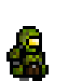

# Shootage AI Evolution

A game demonstrating genetic algorithm evolution where you shoot at AI-controlled targets that learn to dodge your shots over generations.



## Project Overview

Shootage was developed as a code challenge for GamersHub to demonstrate genetic algorithms in an interactive environment. The game combines shooting mechanics with artificial intelligence that evolves over time, creating increasingly challenging gameplay.

## Main Features

- **Interactive Shooting Gameplay**: Click, hold, and release to shoot at moving targets with a charge-based power system.
- **Genetic Algorithm Evolution**: Targets learn to avoid your shots through genetic evolution.
- **Visual Trajectory Prediction**: See the predicted path of your shots.
- **Sound Effects and Background Music**: Immersive audio experience with toggleable settings.
- **Performance Statistics**: Track generations, survival rates, and evolutionary progress.

## How to Play

1. **Launch the Game**: Run the application to see the main menu
2. **Start Game**: Click the "Start Game" button to begin
3. **Shooting Mechanism**:
   - Click and hold to aim
   - Continue holding to charge your shot (more power = faster shots)
   - Release to fire
   - A red trajectory arc shows the predicted path of your shot
   - Green charge bar in the bottom left shows shot power
4. **Controls**:
   - ESC: Show/hide menu
   - SPACE: Start a new round with the current targets
   - N: Evolve to the next generation
   - R: Reset the current round

## The Genetic Algorithm

The game uses a genetic algorithm to evolve target behavior over generations:

### Genome Structure
Targets are controlled by a simple genome with genes representing their movement behavior. Each genome contains parameters that influence:
- Reaction time to shots
- Movement patterns and strategies
- Avoidance priorities

### Evolution Process
1. **Selection**: Targets that survive longer and dodge shots more effectively gain higher fitness scores
2. **Crossover**: The best-performing genomes are combined to produce offspring
3. **Mutation**: Small random changes introduce diversity to prevent stagnation
4. **Fitness Evaluation**: Targets gain fitness for:
   - Survival time
   - Successfully dodging near-miss shots
   - Avoiding areas with high shot density
   - Efficient movement (not wasting energy)
   - Targets lose fitness for clustering with other targets

### Adaptive Difficulty
As generations advance, targets become increasingly adept at avoiding shots, providing a naturally increasing difficulty curve based on player behavior.

## Technical Implementation

- **Java Swing**: Used for the UI and rendering
- **Interface-based Design**: IGenome interface allows for modular genetic algorithm components
- **Sound Management**: Background music and sound effects managed through the SoundManager utility
- **Shot Physics**: Realistic projectile motion with gravity and drag effects
- **Shot History**: Tracks areas where shots frequently land, allowing targets to learn dangerous zones

## Development Potential

Areas for improvement or expansion:

### Gameplay Enhancements
- Different weapon types with unique projectile behaviors
- Multiple player support
- Target counter-attack mechanisms
- Level progression system with varying environments

### AI Improvements
- More complex genome structures for sophisticated behaviors
- Neural network integration for decision making
- Different target types with specialized evolutionary paths
- Visual representation of the evolutionary tree

### Technical Improvements
- Better separation of UI and game logic
- Additional performance optimizations for larger populations
- Saved games and evolution progress
- Replays of particularly interesting evolutionary moments

## Building and Running

This is a Maven project. To build and run:

```bash
  mvn clean package
```
- Then run the file MainFrame.java
- `[note]` Ensure you have Java 11 or higher installed.
- You can also run the game directly from your IDE if it supports Maven projects.

## Resources
- https://opengameart.org/
- https://sketchfab.com/search?q=pixel+art&type=models
- https://github.com/phax/genetic-algorithms/